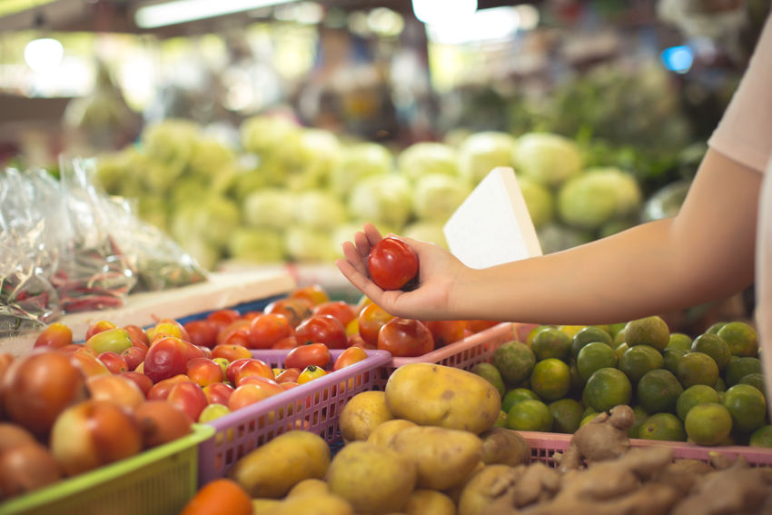

Jeżeli żywisz się zdrowo i odpowiednio do swojego wieku oraz aktywności fizycznej, jaką podejmujesz, to szybko przyniesie to dobre rezultaty. Zdrowe produkty dają więcej energii. Będziesz się lepiej wysypiać, będzie ci się łatwiej skupić na wielu trudnych rzeczach. 

Ekologiczne produkty są dzisiaj dostępne dla każdego. Mnóstwo jest sklepów zarówno stacjonarnych, jak i internetowych, w których możesz znaleźć świetnej jakości produkty ekologiczne z różnych stron świata, a szczególnie z Polski. 

W Polsce jest wiele gospodarstw rolnych, które produkują warzywa i owoce, a także mięso na naturalnych nawozach i bez użycia sztucznych polepszaczy i takie produkty są co prawda droższe, jednak ich smak i jakość jest nieporównywalna z niczym innym.

Z pewnością warto zastosować w swojej diecie takie składniki, bo szybko się przekonasz, że to służy twojemu zdrowiu. Nawet po kilku tygodniach takiej diety możesz odczuć pozytywne efekty w postaci lepszego samopoczucia, ładniejszej skóry, większego poziomu energii i po prostu radości z tego, że udało ci się coś w swoim życiu zmienić. 

Warto zacząć swoją zmianę właśnie od diety, bo ona ma ogromne znaczenie. Dieta decyduje o wszystkim w Twoim życiu.